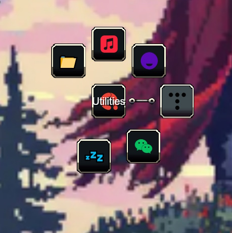

<!--
SPDX-FileCopyrightText: Simon Schneegans <code@simonschneegans.de>
SPDX-License-Identifier: CC-BY-4.0
-->

<p align="center">
  
</p>

# Menu Themes for Kando

[](https://api.reuse.software/info/github.com/kando-menu/menu-themes)
[](https://discord.gg/hZwbVSDkhy)

[Kando](https://github.com/kando-menu/kando) comes with several built-in themes.
This repository contains additional themes that you can use with Kando.
You can easily [create your own theme](https://github.com/kando-menu/kando/blob/main/docs/menu-themes.md)!
If you created something cool, feel free to share it with the community by opening a pull request.

To install a theme, simply download this repository and copy the directory of the theme you want to use into the `menu-themes` directory of your Kando installation.
Depending on your platform, the `menu-themes` directory is located at:

-  Windows: `%appdata%\kando\menu-themes\`
-  macOS: `~/Library/Application Support/kando/menu-themes/`
-  Linux: `~/.config/kando/menu-themes/`

You can also join the [Kando Discord server](https://discord.gg/hZwbVSDkhy) to share your themes and get help with creating them!

## :art: Available Themes

| Theme                                                                                                                                                                                                                                                  | Preview                               |
| ------------------------------------------------------------------------------------------------------------------------------------------------------------------------------------------------------------------------------------------------------ | ------------------------------------- |
| [**Minecraft**](./minecraft)<br>This theme mimics the aesthetics of this well-known computer game. To get the most out of it, it is recommended to use a pixelated icon theme such as [pixelitos](https://github.com/ItzSelenux/pixelitos-icon-theme)! |    |
| [**KnightForge**](./KnightForge)<br>This theme combines style and compactness!                                                                                                                                                                         |  |

## :tada: Add your own Theme (or improve other themes)!

If you created or improved a theme that you want to share with the community, simply open a pull request!
If you need help with that, feel free to ask in the [Kando Discord server](https://discord.gg/hZwbVSDkhy).

### Adding Proper Credits

A theme usually builds upon the work of others.
Therefore, it is important to give proper credit to the original authors!
All the assets you use in your theme may be subject to copyright and may be licensed under different terms.

To allow for this, this repository follows the [REUSE](https://reuse.software/) specification.
As a theme author, it is your responsibility to make sure that there is proper license and copyright information for each file of your theme.
You can follow the existing themes as examples.

#### Where should I put the license information?

For text files like `.json` or `.css`, you can simply add an SPDX license header at the top of the file. This can look like this:

```css
/* SPDX-FileCopyrightText: Your Name <email@server.com> */
/* SPDX-License-Identifier: CC0-1.0 */
```

For binary files like images or fonts, you should create a `REUSE.toml` file in your theme directory.
You can have a look at [this file](https://github.com/kando-menu/menu-themes/blob/main/KnightForge/REUSE.toml) for an example.

#### What is a valid SPDX-FileCopyrightText?

- For **files you copied from others**, you should use the original author's copyright text.
- For **files you created yourself**, the copyright text should ideally be your name and email address.
  If you do not want to share this publicly, you can also use a pseudonym.
  It would be great if it was possible to contact you in case there are questions about your theme.
  So maybe using a Discord handle or a GitHub username is a good idea in this case.
- For **files you modified**, you should add your own copyright line above the original one. There can be multiple `SPDX-FileCopyrightText` in each file.

> [!TIP]
> Some examples of SPDX-FileCopyrightText's are given in [the specification](https://reuse.software/spec-3.3/#format-of-copyright-notices).

#### Which SPDX-License-Identifier should I choose?

If you **copied a file from somewhere else**, you usually have to use the same license as the original file.
There exceptions to this rule, but it is usually a good idea to stick to the original license.

If you **created a file yourself**, you can use any license you like.
For artwork like themes, the [Creative Commons](https://creativecommons.org/share-your-work/) licenses are often a good choice.
Here are some examples:

- If folks should be able to use your file however they like, you can use the `CC0-1.0` license.
- If you want to be credited, you can use the `CC-BY-4.0` license.
- If you want to force others to use the same license for their modifications, you can use the `CC-BY-SA-4.0` license.

> [!TIP]
> A list of all valid SPDX-License-Identifier can be found [here](https://spdx.org/licenses/).

As a rule of thumb, I would recommend using the `CC0-1.0` license for simple configuration files like your `theme.json5` file and another Creative Commons license for your artwork.

#### How is this checked?

There is a continuous integration job that checks if your contribution is compliant.
Only once this check passes, your theme will be merged.
So feel free to open a pull request, and then we can work together to make sure everything is in order!

💖 **Thanks for sharing your creativity with the community!** 💖
