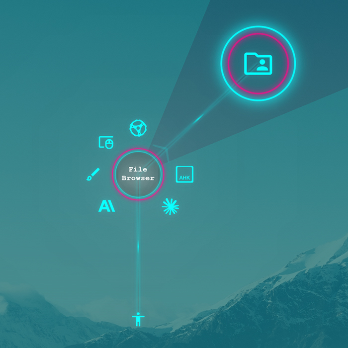

<!--
SPDX-FileCopyrightText: Simon Schneegans <code@simonschneegans.de>
SPDX-License-Identifier: CC-BY-4.0
-->

  

# Menu Themes for Kando

[Kando](https://github.com/kando-menu/kando) comes with several built-in themes.
This repository contains additional themes that you can use with Kando.
You can easily [create your own theme](https://kando.menu/create-menu-themes/)!
If you created something cool, feel free to share it with the community by opening a pull request.

**To install a theme, simply download it and unzip it into the `menu-themes` directory of your Kando installation.**
Depending on your platform, the `menu-themes` directory is located at:

-  Windows: `%appdata%\kando\menu-themes\`
-  macOS: `~/Library/Application Support/kando/menu-themes/`
-  Linux: `~/.config/kando/menu-themes/`

Afterwards, you will have to restart Kando, and then you can select the new theme in the settings.

> [!TIP]
> You can also join the [Kando Discord server](https://discord.gg/hZwbVSDkhy) to share your themes and get help with creating them!

## :art: Available Themes

| Theme                                                                                                                                                                                                                                                                                                                                                                                                                                                            | Preview                                               |
| ---------------------------------------------------------------------------------------------------------------------------------------------------------------------------------------------------------------------------------------------------------------------------------------------------------------------------------------------------------------------------------------------------------------------------------------------------------------- | ----------------------------------------------------- |
| [**EVNTech Vache**](./themes/evntech-vache/) Mix of Nether Lables and default theme.                                                                                                                                                                                                        |         |
| [**Hexperiment**](./themes/hexperiment/)  A very experimental theme. It only works up to 6 items. Also, if you have fewer, you should ensure that all items are arranged in the six cardinal directions. Otherwise, the menu will look weird.                                                 |           |
| [**KnightForge**](./themes/knight-forge/)  This theme combines style and compactness!                                                                                                                                                                                                        |          |
| [**Minecraft**](./themes/minecraft)  This theme mimics the aesthetics of this well-known computer game. To get the most out of it, it is recommended to use a pixelated icon theme such as [pixelitos](https://github.com/ItzSelenux/pixelitos-icon-theme)!                                     |             |
| [**Modified Bent Photon**](./themes/modified-bent-photon/) A variation of the original [Bent Photon Theme](https://github.com/NeighNeighNeigh/Kando_Themes) by NeighNeighNeigh.                                                                                                      |  |
| [**Nether Labels**](./themes/nether-labels/) With its dark and classy colors, this theme features labels on your items and submenus and a sleek overall appearance. If, however, you're style is more bright or flashy, you can fully customize this theme with its 10 colors options.      |         |
| [**Nord**](./themes/nord/)  Clone of Nether Labels theme with Nord color palette.                                                                                                                                                                                                                    |                  |
| [**Neo Ring**](./themes/neo-ring/)  A cyberpunk-style theme with dual neon ring effects and enhanced glow animations.                                                                                                                                                                            |              |
